# 🚀 Supreme System V5 - Sequence Diagrams

## Trading Signal Generation Sequence

### **Complete Trading Signal Flow**

### **Cache Hierarchy Access Pattern**

## Error Recovery & Fault Tolerance

### **Circuit Breaker Failure Recovery**

### **Multi-Tier Connection Pool Management**

## Real-Time WebSocket Streaming

### **WebSocket Market Data Streaming**

### **WebSocket Connection Lifecycle**

## Authentication & Authorization

### **API Key Authentication Flow**

### **Session-Based Authorization**

## Deployment & Scaling

### **Blue-Green Deployment Sequence**

### **Auto-Scaling Sequence**

## Cache Learning & Adaptation

### **Neuromorphic Learning Cycle**

### **Predictive Prefetching**

## Error Escalation & Alerting

### **Error Escalation Flow**

---

## 🎯 **Performance Validation Sequences**

### **Latency SLA Validation**

```mermaid
sequenceDiagram
    participant Test_Harness
    participant API_Server
    participant Cache_System
    participant Metrics_Collector
    participant Validator

    Test_Harness->>API_Server: Send 1000 test requests
    API_Server->>Cache_System: Process requests
    Cache_System-->>API_Server: Responses

    API_Server->>Metrics_Collector: Record latencies
    Metrics_Collector-->>API_Server: Metrics stored

    Test_Harness->>Validator: Request validation
    Validator->>Metrics_Collector: Get latency data

    Validator->>Validator: Calculate P95, P99 latencies
    Validator->>Validator: Check against SLAs

    alt SLA met
        Validator-->>Test_Harness: ✅ SLA validation passed
    else SLA violated
        Validator-->>Test_Harness: ❌ SLA validation failed
        Validator->>Test_Harness: Provide detailed analysis
    end
```

### **Fault Injection Testing**

```mermaid
sequenceDiagram
    participant Chaos_Engine
    participant System_Components
    participant Circuit_Breakers
    participant Recovery_System
    participant Validation_Engine

    Chaos_Engine->>System_Components: Inject failure (Redis disconnect)
    System_Components-->>Chaos_Engine: Failure injected

    Chaos_Engine->>System_Components: Send test requests
    System_Components->>Circuit_Breakers: Circuit breaker triggered
    Circuit_Breakers-->>System_Components: Circuit open

    System_Components->>Recovery_System: Initiate recovery
    Recovery_System->>System_Components: Attempt reconnection
    System_Components-->>Recovery_System: Recovery failed

    Recovery_System->>Recovery_System: Escalate recovery strategy
    Recovery_System->>System_Components: Attempt failover
    System_Components-->>Recovery_System: Failover successful

    Recovery_System->>Circuit_Breakers: Test circuit
    Circuit_Breakers->>System_Components: Send test request
    System_Components-->>Circuit_Breakers: Success response

    Circuit_Breakers->>Circuit_Breakers: Close circuit
    Circuit_Breakers-->>Validation_Engine: Recovery validated

    Validation_Engine-->>Chaos_Engine: ✅ Fault tolerance validated
```

---

## 📋 **System Integration Flows**

### **Complete Request Processing Pipeline**

This comprehensive sequence diagram collection provides detailed insights into the neuromorphic architecture and interaction patterns of Supreme System V5.
