# Supreme System V5 - Git Branching Strategy

## 🌿 **Branching Model Overview**

Supreme System V5 uses a **Git Flow** inspired branching strategy optimized for enterprise development with CI/CD integration.

```
main (production)
├── develop (integration)
│   ├── feature/coverage-improvement
│   ├── feature/gemini-analysis
│   ├── feature/ci-cd-pipeline
│   └── bugfix/pytorch-imports
└── release/v5.0.0 (stabilization)
```

---

## 🏗️ **Branch Types**

### **Main Branch (`main`)**
**Purpose:** Production-ready code
**Protection:** High (requires PR approval)
**Merges:** Only from `release/*` branches
**Deploy:** Automatic to production

**Rules:**
- ✅ Always deployable
- ✅ All tests passing
- ✅ Coverage ≥80%
- ✅ Security audit passed
- ✅ Reviewed and approved

### **Develop Branch (`develop`)**
**Purpose:** Integration branch for features
**Protection:** Medium (requires PR approval)
**Merges:** Feature branches after review
**Deploy:** To staging environment

**Rules:**
- ✅ Latest development state
- ✅ Tests passing
- ✅ No critical bugs
- ✅ Ready for release

### **Feature Branches (`feature/*`)**
**Purpose:** Individual feature development
**Naming:** `feature/descriptive-name`
**Lifetime:** Until feature complete
**Merge Target:** `develop`

**Examples:**
```
feature/coverage-improvement
feature/gemini-multi-key-analysis
feature/ci-cd-pipeline
feature/test-automation
```

### **Bugfix Branches (`bugfix/*`)**
**Purpose:** Critical bug fixes
**Naming:** `bugfix/issue-description`
**Priority:** High
**Merge Target:** `develop` or `main`

**Examples:**
```
bugfix/pytorch-import-crash
bugfix/test-failure-memory-leak
bugfix/api-rate-limiting
```

### **Release Branches (`release/*`)**
**Purpose:** Release stabilization
**Naming:** `release/vX.Y.Z`
**Source:** `develop`
**Merge Target:** `main` and `develop`

---

## 🔄 **Workflow Process**

### **Feature Development Workflow**

```mermaid
graph TD
    A[Create Feature Branch] --> B[Develop Feature]
    B --> C[Write Tests]
    C --> D[Run Local Tests]
    D --> E{Coverage ≥80%?}
    E -->|No| C
    E -->|Yes| F[Commit Changes]
    F --> G[Push Branch]
    G --> H[Create PR]
    H --> I[Code Review]
    I --> J{Approved?}
    J -->|No| B
    J -->|Yes| K[Merge to develop]
    K --> L[Delete Branch]
```



### **Release Process**


---

## 📝 **Commit Standards**

### **Commit Message Format**

```
<type>(<scope>): <description>

[optional body]

[optional footer]
```

### **Commit Types**

| Type | Description | Example |
|------|-------------|---------|
| `feat` | New feature | `feat(gemini): add multi-key parallel analysis` |
| `fix` | Bug fix | `fix(pytorch): resolve import crash on Windows` |
| `docs` | Documentation | `docs(api): update installation guide` |
| `style` | Code style | `style(formatting): apply black formatting` |
| `refactor` | Code refactor | `refactor(tests): optimize test structure` |
| `test` | Testing | `test(coverage): add binance client tests` |
| `chore` | Maintenance | `chore(deps): update requirements.txt` |
| `perf` | Performance | `perf(queries): optimize database queries` |
| `ci` | CI/CD | `ci(actions): add coverage workflow` |
| `build` | Build system | `build(docker): update container config` |

### **Commit Message Examples**

**Good Examples:**
```
feat(gemini): implement 6-key parallel processing

fix(tests): resolve PyTorch import crash in CI

test(coverage): add comprehensive binance client tests

docs(readme): update installation and setup instructions

refactor(utils): extract common test utilities to conftest.py
```

**Bad Examples:**
```
fixed bug
updated code
changes
merge
```

### **Commit Scope Guidelines**

| Scope | Description | Examples |
|-------|-------------|----------|
| `gemini` | Gemini AI integration | API calls, analysis |
| `tests` | Test framework | pytest, fixtures, coverage |
| `ci` | CI/CD pipelines | GitHub Actions, workflows |
| `api` | API clients | Binance, Bybit, data sources |
| `core` | Core trading logic | Strategies, risk management |
| `utils` | Utilities | Helpers, common functions |
| `docs` | Documentation | README, guides, API docs |

---

## 🛡️ **Branch Protection Rules**

### **Main Branch Protection**
```yaml
required_status_checks:
  - ci/circleci: build-and-test
  - ci/circleci: coverage
  - security/bandit
  - quality/flake8

required_pull_request_reviews:
  required_approving_review_count: 2
  dismiss_stale_reviews: true
  require_code_owner_reviews: true

restrictions:
  - enforce_admins: true
  - allow_force_pushes: false
  - allow_deletions: false
```

### **Develop Branch Protection**
```yaml
required_status_checks:
  - ci/circleci: build-and-test
  - quality/flake8

required_pull_request_reviews:
  required_approving_review_count: 1
  dismiss_stale_reviews: true

restrictions:
  - allow_force_pushes: false
  - allow_deletions: false
```

---

## 🔀 **Merge Strategies**

### **Merge Commit (Default)**
- Preserves complete history
- Shows feature branch development
- Recommended for feature branches

### **Squash Merge**
- Clean history for small changes
- Single commit per feature
- Use for bug fixes and small features

### **Rebase Merge**
- Linear history
- Advanced users only
- Requires careful conflict resolution

**Guidelines:**
- **Feature branches:** Merge commit (preserve history)
- **Bugfix branches:** Squash merge (clean history)
- **Release branches:** Merge commit (preserve stabilization)

---

## 🏷️ **Git Tags**

### **Tagging Strategy**
```
v5.0.0-alpha.1    # Alpha releases
v5.0.0-beta.1     # Beta releases
v5.0.0-rc.1       # Release candidates
v5.0.0            # Production releases
v5.0.1            # Patch releases
v5.1.0            # Minor releases
v6.0.0            # Major releases
```

### **Tag Creation**
```bash
# Create annotated tag
git tag -a v5.0.0 -m "Release Supreme System V5.0.0

Features:
- Multi-key Gemini analysis
- Enterprise CI/CD pipeline
- 80% test coverage achieved

Breaking Changes:
- Python 3.8+ required
- API key configuration mandatory"

# Push tag
git push origin v5.0.0
```

---

## 🚨 **Emergency Procedures**

### **Hotfix Process**
1. Create `hotfix/critical-issue` from `main`
2. Implement minimal fix
3. Test thoroughly
4. Merge directly to `main` and `develop`
5. Tag as patch release

### **Rollback Process**
1. Identify problematic commit
2. Create revert commit: `git revert <commit>`
3. Test rollback
4. Deploy rollback
5. Investigate root cause

---

## 📊 **Branch Health Metrics**

### **Daily Monitoring**
- Branch age (>30 days: review)
- Open PR count (>10: prioritize)
- Test failure rate (>5%: investigate)
- Coverage deviation (>5% drop: alert)

### **Weekly Reviews**
- Stale branch cleanup
- PR merge velocity
- Code review turnaround time
- Branch protection compliance

---

## 🛠️ **Tools & Automation**

### **Required Tools**
- **Git:** Version control
- **GitHub CLI:** PR management
- **pre-commit:** Quality gates
- **Git Flow:** Branch management

### **Automation**
- **PR Templates:** Standardized submissions
- **Auto-labeling:** Automatic categorization
- **Status Checks:** Automated quality gates
- **Branch Cleanup:** Stale branch removal

---

## 📚 **Best Practices**

### **General Rules**
- ✅ **Never push directly to main**
- ✅ **Always create feature branches**
- ✅ **Keep branches short-lived (<1 week)**
- ✅ **Regular rebasing from develop**
- ✅ **Descriptive branch names**

### **PR Best Practices**
- ✅ **Single responsibility per PR**
- ✅ **Comprehensive description**
- ✅ **Link related issues**
- ✅ **Request review from domain experts**
- ✅ **Resolve conflicts before review**

### **Commit Best Practices**
- ✅ **Atomic commits**
- ✅ **Meaningful messages**
- ✅ **Reference issues in commits**
- ✅ **Separate refactoring from features**
- ✅ **Test before committing**

---

## 🔍 **Troubleshooting**

### **Common Issues**

**Merge Conflicts:**
```bash
# Rebase on latest develop
git checkout feature/my-feature
git rebase develop

# Resolve conflicts
# Test changes
git rebase --continue
```

**Stale Branches:**
```bash
# Update from develop
git checkout feature/my-feature
git rebase develop

# Force push if needed
git push --force-with-lease
```

**Lost Commits:**
```bash
# Find lost commits
git reflog
git cherry-pick <commit-hash>
```

---

*This branching strategy ensures Supreme System V5 maintains enterprise-grade code quality and deployment reliability.* 🚀


